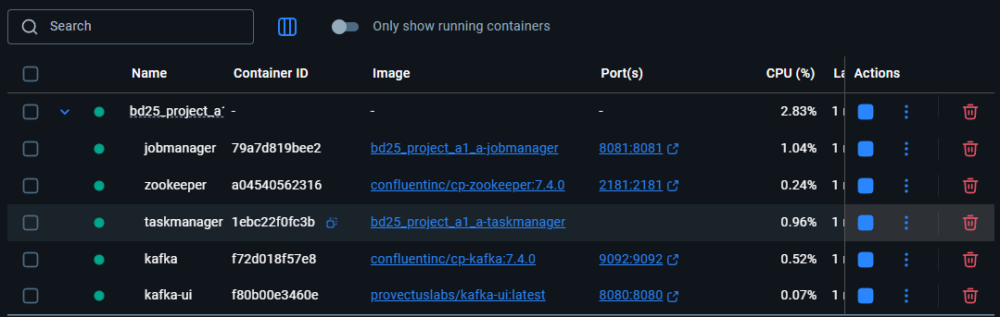
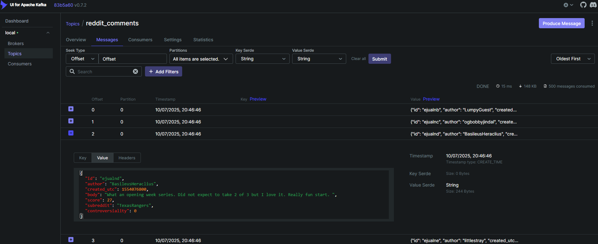
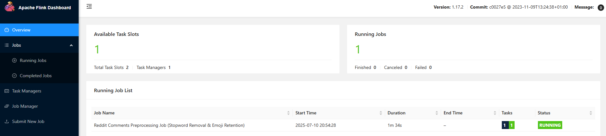
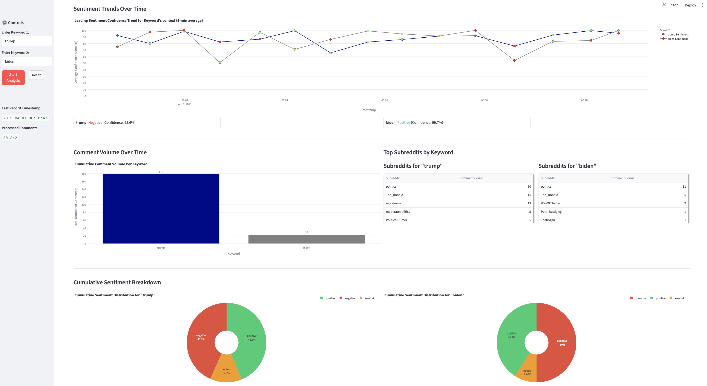

## Sentiment Analysis of millions of processed Reddit comments in near real-time

## Description
Sentiment analysis is a method in natural language processing (NLP) used to identify, extract, and quantify emotions and subjective information from text. In this project, we aim to determine whether the sentiment expressed in Reddit comments is positive or negative towards specific topics or keywords.

For instance, if keywords such as "Trump" and "Harris" are defined, the implemented software should be able to provide statements like "98% positive" for each keyword, based on an analysis of relevant Reddit comments.

To achieve this, the project leverages a cloud-ready, real-time streaming pipeline built using:

* Docker and Docker compose for container orchestration
* Apache Kafka for data ingestion
* Apache Flink for stream processing and sentiment analysis
* Python for the producer and Streamlit dashboard
* Streamlit for interactive visualizations

The comments data is sourced from the [Pushshift Reddit Dataset](https://zenodo.org/records/3608135), specifically the RC_2019-04.zst file containing Reddit comments.
(Only a filtered subset of comments within a specific time range is used to keep it manageable.)

## Installation and Requirements
* Docker & Docker Compose 
* Python
* Add a folder called "data" and place the "RC_2019-04.zst" file inside of it

(OPTIONAL) The docker images for jobkeeper and taskmanager can be separately installed with this commands, however, it is not necessary since this images will be later built in step 3.
`docker pull mayankrawat/bd25_project_a1_a-taskmanager:latest`
`docker pull mayankrawat/bd25_project_a1_a-jobmanager:latest`

## Set-up steps
1. Clone (git clone <repository-URL>) or download this repository. Don´t forget to create a "data" folder with the `RC_2019-04.zst` file inside the folder repository.
2. Open a terminal and run this command to install python dependencies `pip install -r requirements.txt`
3. Start all Docker containers (Kafka, Zookeeper, Flink, etc.): `docker-compose up -d`

Once this command is executed, you should see the container running in Docker desktop.

Note: This might take 8-10 minutes if its the first time this container is created.

4. Launch the Python producer to send Reddit comments to Kafka: `python producer.py` 

Once you run this command, wait for the message "Starting data provider for data/RC_2019-04.zst..." to appear. You can confirm that the data is being decompressed and being sent  to a kafka topic through the kafka UI, as shown here

5. Open a new terminal and submit the Flink job to consume and preprocess the comments: `docker-compose exec jobmanager flink run --python /opt/flink/usrlib/flink_consumer.py`

Once you run this command, wait a few seconds until you see "Job has been submitted with JobID ######### ". This means that your file is running, however, you can verify that is running in the Flink UI, as shown here:

6. Open another new terminal and start the Streamlit dashboard: `streamlit run app_final.py`(or `streamlit run app_lstm.py` to use LSTM model ) 

After following these steps and entering two keywords on the dashboard, you should be able to see the following screen:

Note: If the user wants to run two new keywords, the "Reset" button should be used instead of refreshing the webpage. If the page is refreshed, the backend might possibly crash.

## Authors
Marco Antonio Barrera, Lida Calsamiglia García, Shreya Daga, Mayank Rawat
